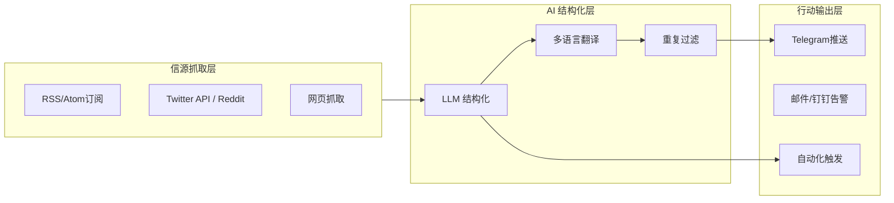

## 📋 本文定位：Part 2 — 轻量级落地指南进阶版

在 [Part 1](/) 我们梳理了 AI 时代的套利认知架构与技术拐点。本文作为延续，重点落地如何将认知转化为实操闭环。

---

## 🎯 第一层进阶：缝隙监控的自动化

Part 1 提到「信息获取优势」，但手动监控仍有成本。Part 2 解决如何自动化：

### 核心架构：信号采集自动化集群



### 实操：区县政务政策监控自动化

```python
# 架构示例：n8n + DeepSeek
workflow:
  trigger: cron (every 30 min)
  1. scrape: local.gov.cn/search "政策公告"
  2. filter: keyword = [政策, 通知, 公告]
  3. llm: deepseek-v4-pro structure:
        - 主题
        - 部门
        - 影响范围
        - 行动 deadlinE
  4. store: Notion [政府-政策库]
  5. deliver: telegram daily summary
```

---

## 🤖 第二层进阶：DeFi 自动化收益优化 Agent

从「手动优化」跨越到「Agent 自动再平衡」。

### Agent 架构：收益优化集群

```python
class YieldOptimizationAgent:
    def __init__(self):
        self.signals = SignalCollector([
            "TVL趋势 (Aave, Morpho, Ethena)",
            "资金费率 (CEX永续)",
            "Gas价格预测"
        ])
        self.strategies = [
            "资金费率Delta中性",
            "基差套利",
            "LP收益最大化"
        ]
        self.risk = RiskController(max_daily_loss=3%)
    
    def cycle(self):
        signals = self.signals.collect()
        optimal = self.strategies.select(signals)
        if self.risk.check(optimal):
            self.executor.execute(optimal)
        else:
            self.risk.circuit_breaker()
```

### 关键落地难点

| 难点 | 解法 |
|---|---|
| Gas 成本可控 | Layer 2 上执行，Batch 交易 |
| MEV 抢先 | 使用意图网络 (ERC-7683) |
| 监管合规 | TEE 可验证执行 (Phala SGX) |

---

## 🔗 第三层进阶：跨市场套利矩阵实操

### 1. 资金费率 Delta 中性

```
仓位:
  - 现货: +1 BTC
  - 永续合约: -1 BTC @ 高于现货价
目标: 年化 15%-30% 的资金费率收入
```

### 2. Initia/新兴链空投套利

```
优势: 机构无法快速进入
操作: 
  1. TVL监控新生态
  2. 流动性提供
  3. 早期退出
```

---

## ⚠️ 风险控制升级

Part 1 提到防线，Part 2 增加自动化防线：

```yaml
risk_framework:
  daily_stop_loss: 3%
  weekly_circuit_break: 5%
  max_single_protocol: 20%
  required_tee: true
  audit_interval: weekly
  emergency_kill_switch: enabled
```

---

## 🔮 结语：从认知到执行的跃迁

Part 1 定义了认知架构，Part 2 提供了执行蓝图。

> **「白皮书不是终点，可复用的模板才是。」**

下一步：Part 3 将发布「个人 AI 套利工具箱开源代码」，包含：
- n8n 工作流模板
- Agent Prompt 库
- 监控仪表盘

---

## 📚 系列交叉索引

- **Part 1**: [从「脚本套利」到「AI Agent 非对称竞争」](/) — 认知架构与白皮书
- **Part 2**: [从「缝隙监控」到「DeFi 自动化」](/) — 轻量级落地指南进阶版 ← 本文
- **Part 3** (Coming Soon): [个人 AI 套利工具箱开源](/) — 代码与模板库

> 本文基于 Notion 知识库《2026.7 AI驱动资产增值与套利白皮书》整理。代码模板请访问 [GitHub](https://github.com/ningfeiyu/ai-arbitrage-toolkit)。
